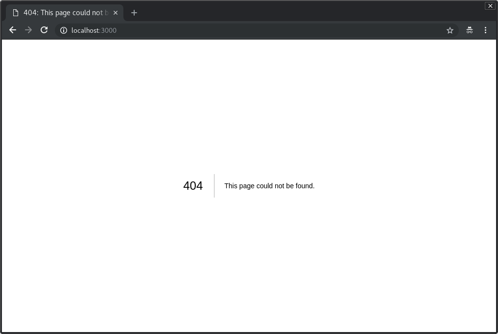

#  Next.js 6 GraphQL Client Tutorial

##  Get Started

**Install Yarn:**
```bash
npm install -g yarn
```

**Initialize Project:**
```bash
mkdir github-client
cd github-client
yarn init
yarn add react react-dom prop-types next
mkdir pages
```

**Update `package.json`:**
```json
{
  "scripts": {
    "dev": "next"
  }
}
```

**Run Dev Server:**
```bash
yarn dev
```

**View 404 Page (localhost:3000):**



## Configure Babel

**Install Babel:**
```bash
yarn add babel-core -D
```

**Install Babel Module Resolver:**
```bash
yarn add babel-plugin-module-resolver -D
```

**`.babelrc`:**
```js
{
  "plugins": [
    ["module-resolver", {
      "root": ["./"],
      "alias": {
        "components": "./components",
        "containers": "./containers",
        "queries": "./graphql/queries"
      }
    }]
  ]
}
```

## Linters

**Install ESLint:**
```bash
yarn add eslint -D
```

**Install Babel ESLint:**
```bash
yarn add babel-eslint -D
```

**Install ESLint Airbnb Config:**
```bash
yarn add eslint-config-airbnb -D
```

**Install ESLint Import Plugin:**
```bash
yarn add eslint-plugin-import -D
```

**Install ESLint JSX A11Y Plugin:**
```bash
yarn add eslint-plugin-jsx-a11y -D
```

**Install ESLint React Plugin:**
```bash
yarn add eslint-plugin-react -D
```

**Initialize ESLint:**
```bash
yarn run eslint --init 
```

**`.eslintrc.json`:**
```js
{
  "parser": "babel-eslint",
  "rules": {
    "react/jsx-filename-extension": ["error", { "extensions": [".js", ".jsx"] }]
  },
  "extends": "airbnb"
}
```


## Material UI

**Install JSS:**
```bash
yarn add jss
```

**Install React JSS:**
```bash
yarn add react-jss
```

**Install Styled-JSX:**
```bash
yarn add styled-jsx
```

**Install Material UI:**
```bash
yarn add @material-ui/core @material-ui/icons
```

**`lib/getPageContext.js`:**
```js
/* eslint-disable no-underscore-dangle */

import { SheetsRegistry } from 'jss';
import { createMuiTheme, createGenerateClassName } from '@material-ui/core/styles';

const theme = createMuiTheme();

function createPageContext() {
  return {
    theme,
    sheetsManager: new Map(),
    sheetsRegistry: new SheetsRegistry(),
    generateClassName: createGenerateClassName(),
  };
}

export default function getPageContext() {
  if (!process.browser) {
    return createPageContext();
  }

  if (!global.__INIT_MATERIAL_UI__) {
    global.__INIT_MATERIAL_UI__ = createPageContext();
  }

  return global.__INIT_MATERIAL_UI__;
}
```

**`pages/_app.js`:**
```js
import React from 'react';
import App, { Container } from 'next/app';
import { MuiThemeProvider } from '@material-ui/core/styles';
import CssBaseline from '@material-ui/core/CssBaseline';
import JssProvider from 'react-jss/lib/JssProvider';
import getPageContext from '../lib/getPageContext';

class MainApp extends App {
  constructor(props) {
    super(props);
    this.pageContext = getPageContext();
  }

  pageContext = null;

  componentDidMount() {
    const jssStyles = document.querySelector('#jss-server-side');
    if (jssStyles && jssStyles.parentNode) {
      jssStyles.parentNode.removeChild(jssStyles);
    }
  }

  render() {
    const { Component, pageProps } = this.props;
    return (
      <Container>
        <JssProvider
          registry={this.pageContext.sheetsRegistry}
          generateClassName={this.pageContext.generateClassName}
        >
          <MuiThemeProvider
            theme={this.pageContext.theme}
            sheetsManager={this.pageContext.sheetsManager}
          >
            <CssBaseline />
            <Component pageContext={this.pageContext} {...pageProps} />
          </MuiThemeProvider>
        </JssProvider>
      </Container>
    );
  }
}

export default MainApp;
```

**`.eslintrc.json`:**
```js
{
  "env": {
    "browser": true
  },
  // ...
}
```


**`pages/_document.js`:**
```js
import React from 'react';
import PropTypes from 'prop-types';
import Document, { Head, Main, NextScript } from 'next/document';
import flush from 'styled-jsx/server';

class MainDocument extends Document {
  render() {
    const { pageContext } = this.props;

    return (
      <html lang="en" dir="ltr">
        <Head>
          <title>Github Client</title>
          <meta charSet="utf-8" />
          <meta
            name="viewport"
            content={
              'user-scalable=0, initial-scale=1, '
              + 'minimum-scale=1, width=device-width, height=device-height'
            }
          />
          <meta name="theme-color" content={pageContext.theme.palette.primary.main} />
          <link
            rel="stylesheet"
            href="https://fonts.googleapis.com/css?family=Roboto:300,400,500"
          />
        </Head>
        <body>
          <Main />
          <NextScript />
        </body>
      </html>
    );
  }
}

MainDocument.getInitialProps = (ctx) => {
  let pageContext;

  const page = ctx.renderPage((Component) => {
    const WrappedComponent = (props) => {
      ({ pageContext } = props);

      return <Component {...props} />;
    };

    WrappedComponent.propTypes = {
      pageContext: PropTypes.shape({}).isRequired,
    };

    return WrappedComponent;
  });

  return {
    ...page,
    pageContext,
    styles: (
      <React.Fragment>
        <style
          id="jss-server-side"
          dangerouslySetInnerHTML={{ __html: pageContext.sheetsRegistry.toString() }}
        />
        {flush() || null }
      </React.Fragment>
    ),
  };
};

export default MainDocument;
```


## Storybook

**Install Storybook:**
```bash
yarn add @storybook/react -D
```

**Update `package.json`:**
```json
{
  "scripts": {
    "storybook": "start-storybook -p 9001 -c .storybook"
  }
}
```

**`.storybook/config.js`:**
```js
import { configure } from '@storybook/react';

const req = require.context('../components', true, /stories\.js$/);

function loadStories() {
  req.keys().forEach(req)
}

configure(loadStories, module);
```

**Install Babel Plugin Require Context Hook:**
```bash
yarn add babel-plugin-require-context-hook -D
```

**`.babelrc`:**
```js
{
  "test": {
    "presets": ["react", "env", "stage-0"],
    "plugins": [
      "require-context-hook"
    ]
  }
}
```

**`lib/testConfig.js`:**
```js
import { configure } from 'enzyme';
import Adapter from 'enzyme-adapter-react-16';
import registerRequireContextHook from 'babel-plugin-require-context-hook/register';

registerRequireContextHook();

export default configure({ adapter: new Adapter() });
```

**`.babelrc`:**
```js
{
  "presets": ["env", "stage-0", "react"]
}
```

**`.eslintrc.json`:**
```js
{
  "import/no-extraneous-dependencies": ["error", { "devDependencies": true }]
}
```

**`components/index.js`:**
```js
const req = require.context('.', true, /\.\/[^/]+\/[^/]+\/index\.js$/);

req.keys().forEach((key) => {
  const componentName = key.replace(/^.+\/([^/]+)\/index\.js/, '$1');
  module.exports[componentName] = req(key).default;
});
```


## Atoms

**Button Atom:**

**`components/atoms/Button/index.js`:**
```js
import React from 'react';
import PropTypes from 'prop-types';
import { Button as MaterialButton } from '@material-ui/core';

const Button = (props) => {
  const { children, ...defaultProps } = props;

  return (
    <MaterialButton {...defaultProps}>
      {children}
    </MaterialButton>
  );
};

Button.propTypes = {
  children: PropTypes.node.isRequired,
};

export default Button;
```

**`components/atoms/Button/index.stories.js`:**
```js
import React from 'react';
import { action } from '@storybook/addon-actions';
import { storiesOf } from '@storybook/react';
import { Button } from '../..';

storiesOf('atoms/Button', module)
  .add('default', () => (
    <Button onClick={action('clicked')}>
      Default
    </Button>
  ))
  .add('outlined primary', () => (
    <Button variant="outlined" color="primary" onClick={action('clicked')}>
      Outline Primary
    </Button>
  ))
  .add('contained secondary', () => (
    <Button variant="contained" color="secondary" onClick={action('clicked')}>
      Contained Secondary
    </Button>
  ))
  .add('circle button', () => (
    <Button variant="fab" color="primary" aria-label="Add" onClick={action('clicked')}>
      CB
    </Button>
  ))
  .add('disabled button', () => (
    <Button variant="contained" color="primary" onClick={action('clicked')} disabled>
      Disabled Button
    </Button>
  ));
```

**Run Storybook:**
```bash
yarn storybook
```


**AppBar Atom:**

**`components/atoms/AppBar/index.js`:**
```js
import React from 'react';
import PropTypes from 'prop-types';
import { AppBar as MaterialAppBar } from '@material-ui/core';

const AppBar = (props) => {
  const { children, ...defaultProps } = props;

  return (
    <MaterialAppBar {...defaultProps}>
      {children}
    </MaterialAppBar>
  );
};

AppBar.propTypes = {
  children: PropTypes.node.isRequired,
};

export default AppBar;
```

**`components/atoms/AppBar/index.stories.js`:**
```js
import React from 'react';
import { storiesOf } from '@storybook/react';
import { AppBar } from '../..';

storiesOf('atoms/AppBar', module)
  .add('default', () => (
    <AppBar>
      <div>Example of AppBar</div>
    </AppBar>
  ))
  .add('secondary', () => (
    <AppBar color="secondary">
      <div>Secondary color</div>
    </AppBar>
  ));
```

**`components/atoms/AppBar/index.test.js`:**
```js
import React from 'react';
import { shallow } from 'enzyme';
import AppBar from '.';

describe('AppBar', () => {
  it('renders children when passed in', () => {
    const wrapper = shallow(<AppBar><div>test</div></AppBar>);
    expect(wrapper.contains(<div>test</div>)).toBe(true);
  });
});
```


**Card Atom:**

**`components/atoms/Card/index.js`:**
```js
import React from 'react';
import PropTypes from 'prop-types';
import { Card as MaterialCard } from '@material-ui/core';

const Card = (props) => {
  const { children, ...defaultProps } = props;

  return (
    <MaterialCard {...defaultProps}>
      {children}
    </MaterialCard>
  );
};

Card.propTypes = {
  children: PropTypes.node.isRequired,
};

export default Card;
```

**`components/atoms/Card/index.stories.js`:**
```js
import React from 'react';
import { storiesOf } from '@storybook/react';
import { Card } from '../..';

storiesOf('atoms/Card', module)
  .add('default', () => (
    <Card>
      Default
    </Card>
  ));
```

**`components/atoms/Card/index.test.js`:**
```js
import React from 'react';
import { shallow } from 'enzyme';
import Card from '.';

describe('Card', () => {
  it('renders children when passed in', () => {
    const wrapper = shallow(
      <Card>
        <p>Some text</p>
        <p>Test</p>
      </Card>,
    );
    expect(wrapper.contains('Test')).toBe(true);
    expect(wrapper.contains('Some text')).toBe(true);
  });
});
```


**CardActions Atom:**

**`components/atoms/CardActions/index.js`:**
```js
import React from 'react';
import PropTypes from 'prop-types';
import { CardActions as MaterialCardActions } from '@material-ui/core';

const CardActions = (props) => {
  const { children, ...defaultProps } = props;

  return (
    <MaterialCardActions {...defaultProps}>
      {children}
    </MaterialCardActions>
  );
};

CardActions.propTypes = {
  children: PropTypes.node.isRequired,
};

export default CardActions;
```

**`components/atoms/CardActions/index.stories.js`:**
```js
import React from 'react';
import { storiesOf } from '@storybook/react';
import { CardActions, Button } from '../..';

storiesOftoms/CardActions', module)
  .add('with button', () => (
    <CardActions>
      <Button>Button</Button>
    </CardActions>
  ));
```

**`components/atoms/CardActions/index.test.js`:**
```js
import React from 'react';
import { shallow } from 'enzyme';
import CardActions from '.';

describe('CardActions', () => {
  it('renders children when passed in', () => {
    const wrapper = shallow(
      <CardActions>
        <p>Some text</p>
        <p>Test</p>
      </CardActions>,
    );
    expect(wrapper.contains('Test')).toBe(true);
    expect(wrapper.contains('Some text')).toBe(true);
  });
});
```


**CardContent Atom:**

**`components/atoms/CardContent/index.js`:**
```js
import React from 'react';
import PropTypes from 'prop-types';
import { CardContent as MaterialCardContent } from '@material-ui/core';

const CardContent = (props) => {
  const { children, ...defaultProps } = props;

  return (
    <MaterialCardContent {...defaultProps}>
      {children}
    </MaterialCardContent>
  );
};

CardContent.propTypes = {
  children: PropTypes.node.isRequired,
};

export default CardContent;
```

**`components/atoms/CardContent/index.stories.js`:**
```js
import React from 'react';
import { storiesOf } from '@storybook/react';
import { CardContent } from '../..';

storiesOfardContent', module)
  .add('default', () => (
    <CardContent>
      <p>Lorem</p>
      <p>Lorem Ipsum</p>
    </CardContent>
  ));
```

**`components/atoms/CardContent/index.test.js`:**
```js
import React from 'react';
import { shallow } from 'enzyme';
import CardContent from '.';

describe('CardContent', () => {
  it('renders children when passed in', () => {
    const wrapper = shallow(
      <CardContent>
        <p>Lorem</p>
        <p>Ipsum</p>
      </CardContent>,
    );
    expect(wrapper.contains('Lorem')).toBe(true);
    expect(wrapper.contains('Ipsum')).toBe(true);
  });
});
```

**(Other Atom Components - IconButton, List, ListItem, ListItemIcon, ListItemText, Loader, MenuIcon, SwipeableDrawer, Toolbar, Typography, Grid - follow similar pattern)**


## Moleculus

**SimpleCard Molecule:**

**`components/moleculus/SimpleCard/index.js`:**
```js
import React from 'react';
import PropTypes from 'prop-types';
import { withStyles } from '@material-ui/core/styles';

import {
  Card, CardContent, Typography, CardActions, Button,
} from 'components';

const styles = {
  card: {
    minWidth: 100,
  },
  bullet: {
    display: 'inline-block',
    margin: '0 2px',
    transform: 'scale(0.8)',
  },
  title: {
    marginBottom: 16,
    fontSize: 14,
  },
  pos: {
    marginBottom: 12,
  },
};

const SimpleCard = (props) => {
  const {
    classes, title, description, url,
  } = props;

  return (
    <Card className={classes.card}>
      <CardContent>
        <Typography variant="headline" component="h3">
          {title}
        </Typography>
        <Typography className={classes.pos} color="textSecondary">
          {description}
        </Typography>
      </CardContent>
      <CardActions>
        <Button target="_blank" href={url} size="small">Learn More</Button>
      </CardActions>
    </Card>
  );
};

SimpleCard.propTypes = {
  classes: PropTypes.shape({}).isRequired,
  title: PropTypes.string.isRequired,
  description: PropTypes.string,
  url: PropTypes.string,
};

SimpleCard.defaultProps = {
  description: 'No description',
  url: null,
};

export default withStyles(styles)(SimpleCard);
```

**`components/moleculus/SimpleCard/index.stories.js`:**
```js
import React from 'react';
import { storiesOf } from '@storybook/react';
import { SimpleCard } from '../..';

storiesOf('moleculus/SimpleCard', module)
  .add('default', () => (
    <SimpleCard title="Default title" description="Default description" />
  ));
```

**`components/moleculus/SimpleCard/index.test.js`:**
```js
import React from 'react';
import { mount } from 'enzyme';
import { SimpleCard, Typography } from '../..';

describe('SimpleCard', () => {
  it('renders header with correct title', () => {
    const wrapper = mount(<SimpleCard title="foo" description="bar" />);
    const typographyNodes = wrapper.find(Typography);
    expect(typographyNodes.first().text()).toEqual('foo');
    expect(typographyNodes.last().text()).toEqual('bar');
  });
});
```


**Header Molecule:**

**`components/moleculus/Header/index.js`:**
```js
import React from 'react';
import PropTypes from 'prop-types';
import { withStyles } from '@material-ui/core/styles';

import {
  AppBar, IconButton,
  MenuIcon, Toolbar, Typography,
} from '../..';

const styles = {
  root: {
    flexGrow: 1,
  },
  flex: {
    flexGrow: 1,
  },
  menuButton: {
    marginLeft: -12,
    marginRight: 20,
  },
};

const Header = (props) => {
  const {
    classes, swipeableMenu, loginButton, title, openMenu,
  } = props;

  return (
    <div className={classes.root}>
      <AppBar position="static">
        {swipeableMenu}
        <Toolbar>
          <IconButton onClick={openMenu} className={classes.menuButton} color="inherit" aria-label="Menu">
            <MenuIcon />
          </IconButton>
          <Typography variant="title" color="inherit" className={classes.flex}>
            {title}
          </Typography>
          {loginButton}
        </Toolbar>
      </AppBar>
    </div>
  );
};

Header.propTypes = {
  swipeableMenu: PropTypes.node,
  loginButton: PropTypes.node,
  classes: PropTypes.shape().isRequired,
  title: PropTypes.string,
  openMenu: PropTypes.func,
};

Header.defaultProps = {
  swipeableMenu: null,
  loginButton: null,
  title: null,
  openMenu: null,
};

export default withStyles(styles)(Header);
```

**`components/moleculus/Header/index.stories.js`:**
```js
import React from 'react';
import { storiesOf } from '@storybook/react';
import { Header } from '../..';

storiesOf('moleculus/Header', module)
  .add('default', () => (
    <Header />
  ))
  .add('with title', () => (
    <Header title="Home" />
  ));
```

**`components/moleculus/Header/index.test.js`:**
```js
import React from 'react';
import { mount } from 'enzyme';
import { Header, Typography } from '../..';

describe('Header', () => {
  it('renders header with correct title', () => {
    const wrapper = mount(<Header title="foo" />);
    const typographyNode = wrapper.find(Typography);

    expect(typographyNode.text()).toEqual('foo');
  });
});
```


## Organisms

**Header with Swipeable Menu:**

**`components/organisms/HeaderWithSwipeableMenu/index.js`:**
```js
import React from 'react';
import PropTypes from 'prop-types';
import { Header, SwipeableMenu } from 'components';

const HeaderWithSwipeableMenu = (props) => {
  const {
    closeMenu, openMenu, loginButtonContainer, leftMenuIsOpened,
  } = props;

  const MENU_ITEMS = [
    {
      id: 1,
      url: '/',
      text: 'Home',
    },
    {
      id: 2,
      url: '/top_ruby',
      text: 'Top Ruby Repositories',
    },
    {
      id: 3,
      url: '/top_js',
      text: 'Top Javascript Repositories',
    },
    {
      id: 4,
      url: '/new_js',
      text: 'New Javascript Repositories',
    },
  ];

  return (
    <Header
      openMenu={openMenu}
      title="Home"
      swipeableMenu={(
        <SwipeableMenu
          isOpenedByDefault={leftMenuIsOpened}
          closeMenu={closeMenu}
          openMenu={openMenu}
          menuItems={MENU_ITEMS}
        />
      )}
      loginButton={loginButtonContainer}
    />
  );
};

HeaderWithSwipeableMenu.propTypes = {
  leftMenuIsOpened: PropTypes.bool.isRequired,
  openMenu: PropTypes.func.isRequired,
  closeMenu: PropTypes.func.isRequired,
  loginButtonContainer: PropTypes.node.isRequired,
};

export default HeaderWithSwipeableMenu;
```

**`components/organisms/HeaderWithSwipeableMenu/index.stories.js`:**
```js
import React from 'react';
import { storiesOf } from '@storybook/react';
import { HeaderWithSwipeableMenu } from 'components';
import { action } from '@storybook/addon-actions';

storiesOf('organisms/HeaderWithSwipeableMenu', module)
  .add('default with click event', () => (
    <HeaderWithSwipeableMenu openMenu={action('open')} />
  ))
  .add('opened by default', () => (
    <HeaderWithSwipeableMenu leftMenuIsOpened />
  ));
```

**`components/organisms/HeaderWithSwipeableMenu/index.test.js`:**
```js
import React from 'react';
import { mount } from 'enzyme';
import { HeaderWithSwipeableMenu } from 'components';

describe('HeaderWithSwipeableMenu', () => {
  it('renders header with swipeable menu', () => {
    const mockedOpenMenu = jest.fn();
    const mockedCloseMenu = jest.fn();

    const wrapper = mount(
      <HeaderWithSwipeableMenu
        leftMenuIsOpened
        openMenu={mockedOpenMenu}
        closeMenu={mockedCloseMenu}
        loginButtonContainer={<React.Fragment />}
      />,
    );

    const expectedMenuItems = [
      'Top Javascript Repositories',
      'Home',
      'Top Ruby Repositories',
      'New Javascript Repositories',
    ];

    wrapper.find('ListItemText').find('Typography').forEach((node) => {
      expect(expectedMenuItems).toContain(node.text());
    });

    wrapper.find('button').simulate('click');
    expect(mockedOpenMenu).toHaveBeenCalled();
  });
});
```


## Templates

**Home Template:**

**`components/templates/Home/index.js`:**
```js
import React from 'react';
import PropTypes from 'prop-types';
import { Grid } from '@material-ui/core';

const Home = (props) => {
  const { header, footer, content } = props;

  return (
    <div>
      {header}
      <div style={{ padding: 12 }}>
        <Grid container spacing={24} style={{ padding: 24 }}>
          {content}
        </Grid>
      </div>
      {footer}
    </div>
  );
};

Home.propTypes = {
  header: PropTypes.node,
  content: PropTypes.node,
  footer: PropTypes.string,
};

Home.defaultProps = {
  header: null,
  content: null,
  footer: null,
};

export default (Home);
```

**`components/templates/Home/index.stories.js`:**
```js
import React from 'react';
import { storiesOf } from '@storybook/react';
import { Home } from '../..';

storiesOf('templates/Home', module)
  .add('default', () => (
    <Home
      cards={[
        { title: 'foo', description: 'bar' },
        { title: 'baz', description: 'craz' },
        { title: 'saz', description: 'taz' },
      ]}
    />
  ));
```

**`components/templates/Home/index.test.js`:**
```js
import React from 'react';
import { mount } from 'enzyme';
import { Home, SimpleCard } from '../..';

describe('Home', () => {
  it('renders component with passed card components', () => {
    const wrapper = mount(
      <Home
        content={[
          <SimpleCard description="desc" title="title1" key={1} />,
          <SimpleCard description="desc" title="title2" key={2} />,
        ]}
      />,
    );

    expect(wrapper.find(SimpleCard)).toHaveLength(2);
  });
});
```


## Pages

**`pages/index.js`:**
```js
import React from 'react';
import { Home } from 'components';
import HeaderContainer from 'containers/HeaderContainer';
import ViewerRepoList from 'containers/ViewerRepoList';

const Index = () => (
  <Home
    header={<HeaderContainer />}
    content={<ViewerRepoList />}
  />
);

export default Index;
```

**(Run `yarn dev` to access localhost:3000)**


## Authentication

**Create Github App:** 
(Follow steps at `https://developer.github.com/apps/building-github-apps/creating-a-github-app/`)

**`next.config.js`:**
```js
require('dotenv').config();

const path = require('path');
const Dotenv = require('dotenv-webpack');

module.exports = {
  webpack: (config) => {
    config.plugins = config.plugins || [];

    config.plugins = [
      ...config.plugins,
      new Dotenv({
        path: path.join(__dirname, '.env'),
        systemvars: true,
      }),
    ];

    return config;
  },
};
```

**`.env`:**
```
GITHUB_CLIENT_ID = '<CLIENT>'
GITHUB_CLIENT_SECRET = '<SECRET>'
```

**Add `.env` to `.gitignore`**

**Containers:**

**`containers/GithubLoginButtonContainer/index.js`:**
```js
import React from 'react';
import Router from 'next/router';
import { Query } from 'react-apollo';
import { Button, Loader } from 'components';
import Cookies from 'js-cookie';
import viewer from 'graphql/queries/viewer';

class GithubLoginButtonContainer extends React.Component {
  handleSignIn = () => {
    Router.push({
      pathname: 'https://github.com/login/oauth/authorize',
      query: {
        client_id: '55a16b6d3467b24fdde9',
      },
    });
  };

  handleSignOut = () => {
    Cookies.remove('access_token');
    Router.push('/');
  };

  render() {
    const { handleSignIn, handleSignOut } = this;

    return (
      <Query query={viewer}>
        {({ loading, error, data }) => {
          if (loading) {
            return (
              <Loader color="secondary" />
            );
          }
          if (error) {
            return (
              <Button color="secondary" onClick={handleSignIn}>
                Sign In
              </Button>
            );
          }
          return (
            <React.Fragment>
              {data.viewer.login}
              <Button color="secondary" onClick={handleSignOut}>
                Sign Out
              </Button>
            </React.Fragment>
          );
        }}
      </Query>
    );
  }
}

export default GithubLoginButtonContainer;
```

**`containers/GithubLoginButtonContainer/index.test.js`:**
```js
import React from 'react';
import { shallow } from 'enzyme';
import GithubLoginButton from 'containers/GithubLoginButton';

jest.mock('next/config', () => () => ({ publicRuntimeConfig: { GithubClientId: '123' } }));

jest.mock('next/router', () => (
  { push: () => ({}) }
));

describe('GithubLoginButton', () => {
  it('renders children when passed in', () => {
    const wrapper = shallow(<GithubLoginButton>Test</GithubLoginButton>);
    expect(wrapper.contains('Test')).toBe(true);
  });

  it('calls SignIn handler', () => {
    const wrapper = shallow(<GithubLoginButton>Test</GithubLoginButton>);
    const instance = wrapper.instance();
    jest.spyOn(instance, 'handleSignIn');
    instance.forceUpdate();
    wrapper.find('Button').simulate('click');
    expect(instance.handleSignIn).toHaveBeenCalled();
  });
});
```


**Callback Page:**

**Install `isomorphic-unfetch`:**
```bash
yarn add isomorphic-unfetch
```

**Install `js-cookie`:**
```bash
yarn add js-cookie
```

**`pages/auth/github/callback.js`:**
```js
import React from 'react';
import Router, { withRouter } from 'next/router';
import fetch from 'isomorphic-unfetch';
import Cookies from 'js-cookie';
import PropTypes from 'prop-types';

class Callback extends React.Component {
  static propTypes = {
    errorMessage: PropTypes.string,
    accessToken: PropTypes.string,
  };

  static defaultProps = {
    errorMessage: undefined,
    accessToken: undefined,
  };

  componentDidMount() {
    const { accessToken } = this.props;

    if (accessToken) {
      Cookies.set('access_token', accessToken);
      Router.push('/');
    }
  }

  static async getInitialProps({ query }) {
    const bodyData = JSON.stringify({
      client_id: process.env.GITHUB_CLIENT_ID,
      client_secret: process.env.GITHUB_CLIENT_SECRET,
      code: query.code,
    });

    const res = await fetch('https://github.com/login/oauth/access_token', {
      headers: {
        Accept: 'application/json',
        'Content-Type': 'application/json',
      },
      method: 'POST',
      body: bodyData,
    });

    const json = await res.json();
    const errorMessage = json.error_description;
    return { errorMessage, accessToken: json.access_token };
  }

  render() {
    const { errorMessage } = this.props;

    if (errorMessage) {
      return (
        <p>{errorMessage}</p>
      );
    }

    return null;
  }
}

export default withRouter(Callback);
```


## GraphQL with Apollo

**Install Apollo Packages:**
```bash
yarn add apollo-boost react-apollo graphql graphql-tag
```

- `apollo-boost` Package containing everything you need to set up Apollo Client
- `react-apollo` View layer integration for React
- `graphql` Also parses your GraphQL queries
- `graphql-tag` Provides template literal tag you can use to concisely write a GraphQL query that is parsed into the standard GraphQL AST

Now you have all the dependencies you need, let’s create your Apollo Client. The only thing you need to get started is the endpoint for your GraphQL server.

If you don’t pass in uri directly, it defaults to the /graphql endpoint on the same host your app is served from.


#### GraphQL authentication

Apollo Client uses the ultra flexible Apollo Link that includes several options for authentication.

We will use cookies for storing github access_token and send it as an authorization header. It’s easy to add an authorization header to every HTTP request by adding `headers` to ApolloClient.

It’s very easy to tell your network interface to send the cookie along with every request. You just need to pass the headers option. e.g. `headers: 'token'`

In this example, we’ll pull the login token from cookies every time a request is sent:

`pages/_app.js`

```js
const token = Cookies.get('access_token');

const client = new ApolloClient({
  uri: 'https://api.github.com/graphql',
  headers: { authorization: `Bearer ${token}` },
});

class MainApp extends App {
  // ...
  render() {
    // ...
    const token = Cookies.get('access_token');

    const client = new ApolloClient({
      uri: 'https://api.github.com/graphql',
      headers: { authorization: `Bearer ${token}` },
    });

    return (
      <Container>
        <ApolloProvider client={client}>
          {/* ... */}
        </ApolloProvider>
      </Container>
    );
  }
}
```

After that we can make requests to Github API using our token from cookies.

#### GraphQL queries

Let's implement our first graphql query

This query finds last 50 repositories with more than 10000 stars

`queries/searchTopRubyRepos.js`

```js
import gql from 'graphql-tag';

const searchTopRubyRepos = gql`
{
  search(query: "language:Ruby stars:>10000", first: 50, type: REPOSITORY) {
    edges {
      node {
        ... on Repository {
          name
          description
          url
        }
      }
    }
  }
}
`;

export default searchTopRubyRepos;
```

`containers/SearchRepoList/index.js`

```js
import React from 'react';
import PropTypes from 'prop-types';
import {
  SimpleCard, Loader, Grid, Typography,
} from 'components';
import { Query } from 'react-apollo';

const SearchRepoList = ({ query }) => (
  <Query query={query}>
    {({ loading, error, data }) => {
      if (loading) {
        return (
          <Grid direction="row" justify="center" container spacing={24} style={{ padding: 24 }}>
            <Loader size={300} />
          </Grid>
        );
      }
      if (error) {
        return (
          <Grid direction="row" justify="center" container spacing={24} style={{ padding: 24 }}>
            <Typography variant="headline">Please Sign In to fetch data</Typography>
          </Grid>
        );
      }
      return (
        <React.Fragment>
          {data.search.edges.map(repo => (
            <Grid key={repo.node.id} item xs={6} sm={4} lg={3} xl={2}>
              <SimpleCard
                title={repo.node.name}
                description={repo.node.description}
                url={repo.node.url}
              />
            </Grid>
          ))}
        </React.Fragment>
      );
    }}
  </Query>
);

SearchRepoList.propTypes = {
  query: PropTypes.node.isRequired,
};

export default SearchRepoList;
```

Now let's implement nextjs page

```js
import React from 'react';
import { Home } from 'components';
import HeaderWithMenu from 'containers/HeaderWithMenu';
import SearchRepoList from 'containers/SearchRepoList';
import searchTopRubyRepos from 'graphql/queries/searchTopRubyRepos';

const TopRuby = () => (
  <Home
    header={<HeaderWithMenu />}
    content={<SearchRepoList query={searchTopRubyRepos} />}
  />
);

export default TopRuby;
```

## Step 15 - Creating Snapshot tests

Snapshot testing is a very useful tool whenever you want to make sure your UI doesn’t change unexpectedly.

A typical snapshot test case for a mobile app renders a UI component, takes a screenshot, then compares it to a reference image stored alongside the test. The test will fail if the two images don’t match: either the change is unexpected, or the screenshot needs to be updated to the new version of the UI component.

To add react-test-render, write this command

```bash
yarn add react-test-renderer -D
```

This package provides a React renderer that can be used to render React components to pure JavaScript objects, without depending on the DOM or a native mobile environment.

`__tests__/index.test.js`

```js
import React from 'react';
import renderer from 'react-test-renderer';
import Index from 'pages';
import { mount } from 'enzyme';
import viewerLast100Repositories from 'graphql/queries/viewerLast100Repositories';
import { MockedProvider } from 'react-apollo/test-utils';

describe('Home Page', () => {
  it('renders loading state initially', () => {
    const component = renderer.create(
      <MockedProvider mocks={[]} addTypename={false}>
        <Index />
      </MockedProvider>,
    );

    const tree = component.toJSON();
    expect(tree).toMatchSnapshot();
  });

  it('renders cards with all information on success', async () => {
    const mocks = [
      {
        request: {
          query: viewerLast100Repositories,
        },
        result: {
          data: {
            viewer: {
              repositories: {
                edges: [
                  { node: { id: '1', name: 'repo name', description: 'desc' } },
                ],
              },
            },
          },
        },
      },
    ];

    const component = renderer.create(
      <MockedProvider mocks={mocks} addTypename={false}>
        <Index />
      </MockedProvider>,
    );
    await new Promise(resolve => setTimeout(resolve));

    const tree = component.toJSON();
    expect(tree).toMatchSnapshot();
  });

  it('renders correct message on error', async () => {
    const mock = {
      request: {
        query: viewerLast100Repositories,
      },
      error: new Error('error'),
    };

    const component = renderer.create(
      <MockedProvider mocks={[mock]} addTypename={false}>
        <Index />
      </MockedProvider>,
    );
    await new Promise(resolve => setTimeout(resolve));

    const tree = component.toJSON();
    expect(tree).toMatchSnapshot();
  });
});
```

`__tests__/auth/github/callback.test.js`

```js
import React from 'react';
import renderer from 'react-test-renderer';
import Router from 'next/router';
import Callback from '../../../pages/auth/github/callback';

describe('Github Callback Page', () => {

  it('matches snapshot', () => {
    const mockedRouter = { push: () => {} };
    Router.router = mockedRouter;
    const component = renderer.create(<Callback accessToken="sag" />);
    const tree = component.toJSON();
    expect(tree).toMatchSnapshot();
  });
});
```

## Demo App

https://next-github.herokuapp.com/
